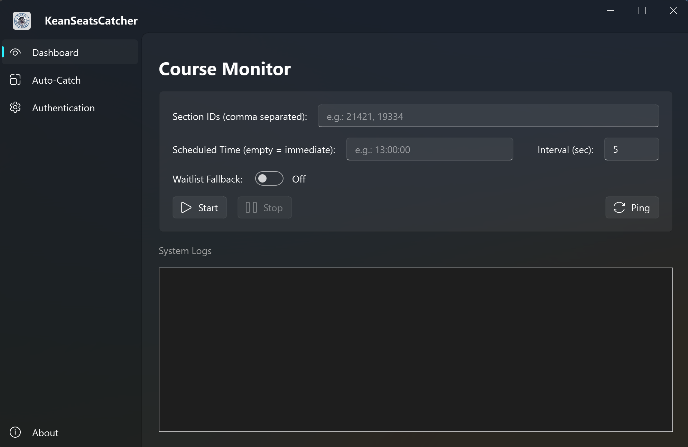

<p align="center">
  
</p>

<h1 align="center">KeanSeatsCatcher</h1>

<p align="center">
  <em>An elegant, asynchronous concurrency toolkit engineered for Ellucian Banner 9 architecture.</em>
</p>

<p align="center">
  
  
  
</p>

---

<p align="center">
  
</p>

## ⚠️ Disclaimer

This software is an external auxiliary toolkit designed strictly for **educational purposes**, specifically for the study of HTTP API reverse engineering, concurrent network requests, and Python GUI automation patterns.

It interacts with the Ellucian Banner 9 system solely via standard web API endpoints. It does not exploit system vulnerabilities, nor does it circumvent authorization protocols. This project is open-source and free, intended for personal learning and academic communication.

Do not use this software for any commercial or profit-making activities, or any purpose that violates your institution's acceptable use policies. The developer assumes no liability for any consequences arising from the improper use of this software.

## 🌌 Core Architecture

Engineered with a focus on high-frequency state monitoring and payload delivery, `KeanSeatsCatcher` abstracts the complexities of the underlying registration system into a streamlined, high-performance GUI.

- **Asynchronous Payload Engine:** Zero-blocking concurrent request execution, ensuring millisecond-level responsiveness during high-traffic server windows.
- **Heuristic Fallback Mitigation:** Intelligent state detection that automatically degrades strategies (e.g., dynamic Waitlist routing) upon encountering specific API rejection codes.
- **Automated Session Harvesting:** Chromium-based credential extraction utilizing Selenium WebDriver to securely bridge SSO (Single Sign-On) session states.
- **Fluent UI Implementation:** A meticulously crafted interface utilizing `qfluentwidgets`, delivering a native, responsive Dark Tech aesthetic.

## ⚙️ Build & Execution

Ensure you have a stable Python 3.9+ environment.

```bash
# Clone the repository
git clone https://github.com/Daozhu1007/KeanSeatsCatcher.git
cd KeanSeatsCatcher

# Install dependencies
pip install -r requirements.txt

# Ignite the engine
python ui_main.py
```

### 🎯 Execution Protocol

Operation requires a valid Ellucian Banner 9 SSO session.

Provide the target parameters via the interface. The precise definition and retrieval method of a Section ID are left as an exercise for the reader.

### 📂 Project Structure

```
KeanSeatsCatcher/
├── ui_main.py          # Application entry & PyQt6 shell
├── core_api.py         # Request engine & state machine
├── core_auth.py        # SSO token extractor
├── i18n.py             # Localization manager
└── locales/            # Language mapping matrices
```

## 📄 License

Distributed under the MIT License. See `LICENSE` for more information.
