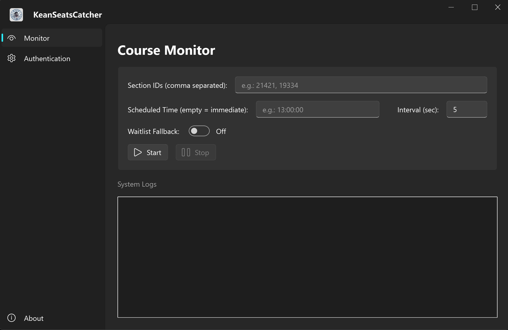

<p align="center">
  
</p>

<h1 align="center">KeanSeatsCatcher</h1>

<p align="center">
  <em>An elegant, asynchronous concurrency toolkit engineered for Ellucian Banner 9 architecture.</em>
</p>

<p align="center">
  
  
  
  <a href="https://space.bilibili.com/477852567"></a>
</p>

---

<p align="center">
  
</p>

## ⚠️ Disclaimer

This software is an external auxiliary toolkit intended for **personal, non-commercial use only**. It is shared for educational purposes — specifically the study of HTTP API interaction, asynchronous concurrency, and Python GUI patterns.

It operates exclusively through standard, publicly accessible web API endpoints of the Ellucian Banner 9 system using your own authenticated session. It does not exploit vulnerabilities or bypass authorization mechanisms.

However, be aware of the following real risks:

- **Institutional policy:** Automated or high-frequency interactions with your institution's registration system may violate its acceptable use policy. You are solely responsible for understanding and complying with your institution's rules before use.
- **Account risk:** Excessive request rates could trigger rate-limiting or account suspension at your institution's discretion.
- **No warranty:** This software is provided as-is. The developer assumes no liability for any academic, administrative, or legal consequences arising from its use.

Use it on your own account, at your own risk.

## 🌌 Core Architecture

Engineered with a focus on high-frequency state monitoring and payload delivery, `KeanSeatsCatcher` abstracts the complexities of the underlying registration system into a streamlined, high-performance GUI.

- **Asynchronous Payload Engine:** Zero-blocking concurrent request execution, ensuring millisecond-level responsiveness during high-traffic server windows.
- **Heuristic Fallback Mitigation:** Intelligent state detection that automatically degrades strategies (e.g., dynamic Waitlist routing) upon encountering specific API rejection codes.
- **Automated Session Harvesting:** Chromium-based credential extraction utilizing Selenium WebDriver to securely bridge SSO (Single Sign-On) session states.
- **Fluent UI Implementation:** A meticulously crafted interface utilizing `qfluentwidgets`, delivering a native, responsive Dark Tech aesthetic.

## ⚙️ Deployment

We offer two operational deployment methods. Navigate to the **[Releases](../../releases)** page to acquire the latest builds.

- **Setup Installer (`KeanSeatsCatcher_vX.X_Setup.exe`):** A full Windows installer with Start Menu shortcuts, desktop icon, and automatic uninstaller registration. Recommended for most users.
- **Portable Archive (`KeanSeatsCatcher-vX.X.zip`):** Standalone pre-built bundle. Extract and run `KeanSeatsCatcher.exe` directly — no installation required.

### Running from Source

Ensure you have a stable Python 3.9+ environment.

```bash
# Clone the repository
git clone https://github.com/Daozhu1007/KeanSeatsCatcher.git
cd KeanSeatsCatcher

# Install dependencies
pip install -r requirements.txt

# Launch
python ui_main.py
```

## 🎯 Execution Protocol

Operation requires a valid Ellucian Banner 9 SSO session. On first launch, the app will open a Chromium browser window for you to complete SSO login; the session token is then extracted automatically.

The retrieval method for Section IDs is not documented here. This project assumes you already know how to locate the target identifiers within your institution's registration portal.

## ⚠️ Known Limitations

- **Windows only:** The Selenium-based SSO session harvesting relies on Windows-specific Chromium driver paths. Cross-platform support is not currently planned.
- **Single session:** Only one SSO session is active at a time. If your session expires mid-run, stop the engine, re-authenticate via the auth panel, and restart.
- **Multiple sections:** You can monitor multiple Section IDs simultaneously by adding them as separate targets in the interface. Success on one target does not auto-stop others.

## 📂 Project Structure

```
KeanSeatsCatcher/
├── ui_main.py          # Application entry & PyQt6 shell
├── core_api.py         # Request engine & state machine
├── core_auth.py        # SSO token extractor
├── i18n.py             # Localization manager
└── locales/            # Language mapping matrices
```

## 📄 License

Distributed under the MIT License. See `LICENSE` for more information.
